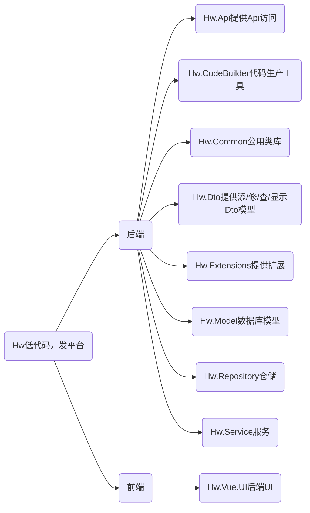

# Hw 低代码开发平台
# 项目简介
Hw 是一套基于代码生成器的低代码开发平台。 前后端分离，数据库优先模式。帮助解决开发过程中大量重复的CURD工作。Hw代码简洁，没有高深语法，让小白也能快速上手。

# 架构简介

## 后端技术
.net Core5，FreeSql，AutoMapper，Autofac，log4net
## 前端技术
Vue，Vuex，iview

# 功能简介

## 已完成功能

v 0.0.1
+ [x] 基于数据库关系图快速生成CURD API
+ [x] 基础中后台管理

## 计划功能

+ [ ] 集成权限管理
+ [ ] 数据合法性验证
+ [ ] JWT

# 使用文档
## 如何生成后端代码
思路：使用chiner设计数据库模型，根据模型文件生成后端代码。
> [chiner定制版](https://github.com/hw952/chiner) 可参考 https://github.com/hw952/chiner
> [chiner](https://gitee.com/robergroup/chiner) 使用方法可参考 https://gitee.com/robergroup/chiner
### 使用chiner设计数据库模型
使用chiner打开Hw.CodeBuilder/demo.chnr.json 这里保存了我定制[chiner](https://github.com/hw952/chiner)的一些信息，demo中包含了一个简单的权限管理的数据库设计。
   

基于此可完成自己模型设计。设计完成后在**Hw.CodeBuilder**项目中运行**dotnet run**生成对应的后端代码
>Hw.CodeBuilder 中很多路径是写死的，记得修改哟！ 
### chiner定制字段明细说明

| 新增字段 | 说明                     |
| -------- | ------------------------ |
| Dto添加  | 实体模型添加时显示的字段 |
| Dto修改  | 实体模型修改时显示的字段 |
| Dto显示  | 实体模型展示时显示的字段 |
| Dto搜索  | 未实现                   |
| ParentId | 用于存储树形结构上一级Id |

### 数据域生成对应C#类型说明

| 域字段     | C#类型    | 说明                                                                        |
| ---------- | --------- | --------------------------------------------------------------------------- |
| 默认字符串 | string    |
| 主键标识   | -         | 未实现                                                                      |
| 名称       | -         | 未实现                                                                      |
| 整数       | int       |
| 小数       | -         | 未实现                                                                      |
| 时间日期   | DateTime  |                                                                             |
| 是否       | bool      |                                                                             |
| 数据字典   | enum      |                                                                             |
| 描述文本   | -         | 未实现                                                                      |
| 密码       | string    |                                                                             |
| 批量添加   | list<int> | 用于多对多关系转换成的一对多的批量添加 （可参考添加用户时对应的角色可多选） |

### ui建议选项
   根据Ui选项，前端会解析对应的输入类型

| 选项             | 说明                               |
| ---------------- | ---------------------------------- |
| 普通输入框       |                                    |
| 下拉输入框       |                                    |
| 下拉(多选)输入框 | 批量添加第三张表时选择             |
| 复选框           | 未实现                             |
| 单选框           | 未实现                             |
| 小数输入         | 未实现                             |
| 整数输入         | 未实现                             |
| 金额输入         | 未实现                             |
| 日期输入         | 未实现                             |
| 年月输入         | 未实现                             |
| 长文本输入       | 未实现                             |
| 富文本输入       | 未实现                             |
| 密码输入框       |                                    |
| 下拉(多选)树     | 树形结构时，批量添加第三张表时选择 |
| Icon选择         |                                    |

### 根据关系图生成实体类关系
   
| 关系类型 | 说明                         |
| -------- | ---------------------------- |
| 1：N     |                              |
| 1：1     | 未实现                       |
| N：N     | 不支持（建议转换为1：N关系） |

### 使用小技巧
#### 如何显示关系 N：1 中 1的某个字段

| 字段代码               | ... | Dto显示                           |
| ---------------------- | --- | --------------------------------- |
| 1_字段名称① | ... | <input type="checkbox" checked /> |

> ① "1" 表示表关系1中的表名称，必须与实际的一致 。 "_" 分隔符必须存在 。 "字段名称" 表关系1中的对应的字段名，必须存在 

#### 如何批量添加N：N(转换后的1：N模型)

如图在用户管理中批量添加对应的用户角色
| 字段代码         | ... | Dto添加                           | ... | 数据域   | ... | ui建议选项       |
| ---------------- | --- | --------------------------------- | --- | -------- | --- | ---------------- |
| Role① | ... | <input type="checkbox" checked /> | ... | 批量添加 | ... | 下拉(多选)输入框 |
> ① 必须为第三张表名称
#### 如何保留自己的代码，不被新生成的代码覆盖
代码块包裹在#region  ... #endregion 里的代码再下次生成代码时会保留
#### 如何生成后端代码
数据库模型设计完成后。在**Hw.CodeBuilder**项目中运行**dotnet run**生成对应的后端代码